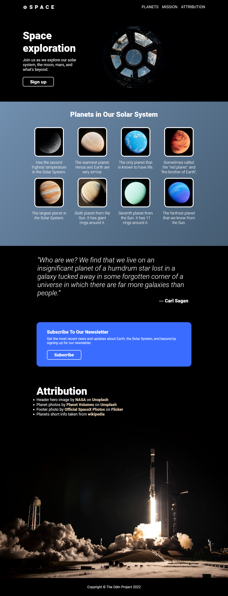

# landing-page

I made this landing page using HTML and CSS while taking [The Odin Project](https://www.theodinproject.com/) course.

Attribution
-   Header hero image by [NASA](https://unsplash.com/photos/CpHNKNRwXps) on [Unsplash](https://unsplash.com/)
-   Planet photos by [Planet Volumes](https://unsplash.com/@planetvolumes) on [Unsplash](https://unsplash.com/)
-   Footer photo by [Official SpaceX Photos](https://www.flickr.com/photos/spacex/51737479675/) on [Flicker](https://www.flickr.com/)
-   Planets short info taken from [wikipedia](https://simple.wikipedia.org/wiki/List_of_planets)

## Preview

[ Live Demo](https://aymansor.github.io/landing-page/)

